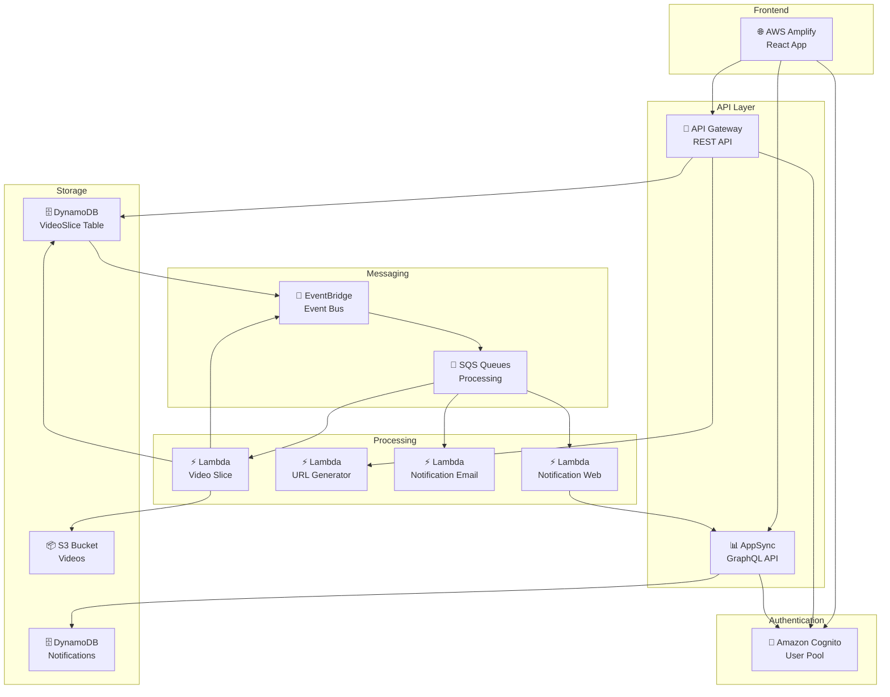

# Video Slice - Infraestrutura como Código (IaC)
[](https://github.com/11soat-hackathon-videoslice/iac/actions/workflows/terraform-deploy.yaml)

Repositório de Infraestrutura como Código (IaC) para aprovisionamento da infraestrutura cloud do sistema VideoSlice utilizando Terraform.

## Índice

- [Visão Geral](#-visão-geral)
- [Arquitetura](#-arquitetura)
- [Componentes da Infraestrutura](#-componentes-da-infraestrutura)
- [AppSync - API GraphQL](#-appsync---api-graphql)
- [API Gateway - REST API](#-api-gateway---rest-api)
- [Amplify - Frontend Deployment](#-amplify---frontend-deployment)
- [Estrutura do Projeto](#-estrutura-do-projeto)
- [Configuração](#-configuração)
- [Deploy](#-deploy)
- [Módulos Terraform](#-módulos-terraform)
- [Variáveis de Ambiente](#-variáveis-de-ambiente)
- [Monitoramento](#-monitoramento)
- [Segurança](#-segurança)

## 📋 Visão Geral

Este repositório contém toda a infraestrutura necessária para o sistema VideoSlice, uma plataforma serverless para processamento de vídeos e captura de frames. A infraestrutura é provisionada utilizando **Terraform** e segue as melhores práticas de **Infrastructure as Code (IaC)**.

### Principais Características

- **100% Serverless**: Utiliza apenas serviços gerenciados da AWS
- **Event-Driven**: Arquitetura orientada a eventos com EventBridge
- **Escalabilidade Automática**: Auto-scaling nativo dos serviços AWS
- **Monitoramento Integrado**: CloudWatch Logs e Metrics
- **Segurança**: IAM roles com princípio do menor privilégio
- **CI/CD**: Deploy automatizado via GitHub Actions

## 🏗️ Arquitetura

A arquitetura do VideoSlice é baseada em microserviços serverless, utilizando os seguintes componentes principais:



## 🧩 Componentes da Infraestrutura

### Core Services

| Serviço | Descrição | Função |
|---------|-----------|--------|
| **Amazon Cognito** | Autenticação e autorização | Gerenciamento de usuários e sessões |
| **AWS Lambda** | Processamento serverless | Execução de lógica de negócio |
| **Amazon DynamoDB** | Banco NoSQL | Armazenamento de dados de vídeos e notificações |
| **Amazon S3** | Armazenamento de objetos | Storage de vídeos e arquivos processados |
| **Amazon SQS** | Filas de mensagens | Processamento assíncrono e desacoplamento |
| **Amazon EventBridge** | Barramento de eventos | Orquestração de eventos entre serviços |
| **AWS Amplify** | Hospedagem frontend | Deploy e hosting da aplicação React |

### API Services

| Serviço | Tipo | Função |
|---------|------|--------|
| **API Gateway** | REST API | Endpoints para upload e listagem de vídeos |
| **AppSync** | GraphQL API | API em tempo real para notificações |

## 📊 AppSync - API GraphQL

O **AWS AppSync** fornece uma API GraphQL em tempo real para o sistema de notificações, permitindo subscriptions para atualizações instantâneas no frontend.

### Schema GraphQL

```graphql
type Notification @aws_iam @aws_cognito_user_pools @aws_api_key {
    id: ID!
    timestamp: String!
    userId: String!
    message: String
    status: String
    isRead: Boolean
    videoId: String
    fileName: String
    fileExtension: String
}

type Query {
    getNotificationsByUser(
        userId: ID!,
        limit: Int,
        nextToken: String,
        sortDirection: ModelSortDirection,
        isRead: Boolean
    ): NotificationConnection
        @aws_iam @aws_api_key @aws_cognito_user_pools
}

type Mutation {
    createNotification(input: CreateNotificationInput!): Notification
        @aws_api_key @aws_iam @aws_cognito_user_pools
    
    markAsRead(id: ID!, timestamp: String!): Notification
        @aws_api_key @aws_iam @aws_cognito_user_pools
}

type Subscription {
    onCreateNotification(userId: ID!): Notification
        @aws_subscribe(mutations: ["createNotification"])
        @aws_iam @aws_api_key @aws_cognito_user_pools
}
```

### Resolvers JavaScript

#### Query - Buscar Notificações por Usuário

```javascript
// Query.getNotificationsByUser.js
import { util } from '@aws-appsync/utils';

export function request(ctx) {
    const { userId, limit = 20, nextToken } = ctx.arguments;

    return {
        operation: 'Query',
        index: 'userId', 
        query: {
            expression: 'userId = :userId',
            expressionValues: util.dynamodb.toMapValues({ ':userId': userId }),
        },
        filter: {
            expression: 'isRead = :isRead',
            expressionValues: util.dynamodb.toMapValues({ ':isRead': false }),
        },
        scanIndexForward: false, 
        limit: limit,
        nextToken: nextToken,
    };
}

export function response(ctx) {
    return ctx.result;
}
```

### Configuração Terraform

```hcl
resource "aws_appsync_graphql_api" "this" {
  name                 = var.api_name
  authentication_type  = var.authentication_type
  schema               = file("${path.module}/schema/schema.graphql")
  
  additional_authentication_provider {
    authentication_type = "AWS_IAM"
  }
  
  additional_authentication_provider {
    authentication_type = "AMAZON_COGNITO_USER_POOLS"
    user_pool_config {
      aws_region   = var.cognito_aws_region
      user_pool_id = var.cognito_user_pool_id
    }
  }
}

resource "aws_appsync_resolver" "get_notifications_by_user" {
  api_id      = aws_appsync_graphql_api.this.id
  field       = "getNotificationsByUser"
  type        = "Query"
  data_source = aws_appsync_datasource.dynamodb.name
  runtime {
    name            = "APPSYNC_JS"
    runtime_version = "1.0.0"
  }
  code = file("${path.module}/resolvers/Query.getNotificationsByUser.js")
}
```

## 🚪 API Gateway - REST API

O **Amazon API Gateway** fornece endpoints REST para operações de upload, processamento e listagem de vídeos, com integração direta ao DynamoDB e Lambda.

### Endpoints Disponíveis

| Método | Endpoint | Descrição | Integração |
|--------|----------|-----------|------------|
| `POST` | `/video/upload/url/{fileName}` | Gera URL pré-assinada para upload | Lambda (URL Generator) |
| `POST` | `/video/upload` | Registra metadados do vídeo | DynamoDB (Direct Integration) |
| `GET` | `/video/list/user/{userId}` | Lista vídeos do usuário | DynamoDB (Direct Integration) |
| `POST` | `/video/process/{videoId}` | Inicia processamento do vídeo | Lambda (Video Slice) |

### Templates de Integração

#### Request Template - Upload de Vídeo

```json
{
    "TableName": "VideoSlice",
    "Item": {
        "videoId": { "S": "$inputRoot.videoId" },
        "created": { "S": "$inputRoot.created.replace('T', ' ').replace('Z', '.0000Z')" },
        "endTime": { "N": "$inputRoot.endTime" },
        "fileName": { "S": "${inputRoot.fileName}" },
        "fileExtension": { "S": "${inputRoot.fileExtension}" },
        "userId": { "S": "$inputRoot.userId" },
        "status": { "S": "$inputRoot.status" },
        "startTime": { "N": "$inputRoot.startTime" },
        "intervalTime": {
            "L": [
                #foreach($item in $inputRoot.intervalTime)
                { "S": "$item" }#if($foreach.hasNext),#end
                #end
            ]
        }
    }
}
```

#### Request Template - Listagem por Usuário

```json
{
    "TableName": "VideoSlice",
    "IndexName": "userId",
    "KeyConditionExpression": "userId = :userId",
    "ExpressionAttributeValues": {
        ":userId": {
            "S": "$method.request.path.userId"
        }
    }
}
```

### Configuração Terraform

```hcl
resource "aws_api_gateway_integration" "upload_dynamodb" {
  rest_api_id             = aws_api_gateway_rest_api.this.id
  resource_id             = aws_api_gateway_resource.video_upload.id
  http_method             = aws_api_gateway_method.upload_post.http_method
  integration_http_method = "POST"
  type                    = "AWS"
  uri                     = "arn:aws:apigateway:${data.aws_region.current.name}:dynamodb:action/PutItem"
  credentials             = var.api_gateway_role_arn
  request_templates = {
    "application/json" = file("${path.module}/templates/post_video_upload_request_template.json")
  }
}

resource "aws_api_gateway_integration" "list_user_dynamodb" {
  rest_api_id             = aws_api_gateway_rest_api.this.id
  resource_id             = aws_api_gateway_resource.video_list_user_id.id
  http_method             = aws_api_gateway_method.list_user_get.http_method
  integration_http_method = "POST"
  type                    = "AWS"
  uri                     = "arn:aws:apigateway:${data.aws_region.current.name}:dynamodb:action/Query"
  credentials             = var.api_gateway_role_arn
  request_templates = {
    "application/json" = file("${path.module}/templates/get_list_userid_request_template.json")
  }
}
```

## 🌐 Amplify - Frontend Deployment

O **AWS Amplify** gerencia o deploy automático da aplicação React, com integração ao GitHub e configuração de variáveis de ambiente.

### BuildSpec Configuration

```yaml
version: 1
appRoot: vdsc-react-app
frontend:
  phases:
    preBuild:
      commands:
        - npm ci
        
    build:
      commands:
        - echo "Gerando build de produção..."
        - npm run build

    postBuild:
      commands:
        - echo "Iniciando deploy para S3..."
        - export BRANCH_NAME=${AWS_BRANCH}
        - aws s3 sync build/ s3://vdsc-prd-s3-videos/deploy/amplify/vdsc-web-app/${BRANCH_NAME}/ --delete --region us-east-1
        - echo "Deploy concluído com sucesso para branch ${BRANCH_NAME}!"

  artifacts:
    baseDirectory: build
    files:
      - '**/*'

  cache:
    paths:
      - node_modules/**/*
```

### Variáveis de Ambiente React

```hcl
resource "aws_amplify_app" "this" {
  name       = var.app_name
  repository = var.repository
  
  environment_variables = {
    REACT_APP_API_GATEWAY_URL     = module.api_gateway.invoke_url
    REACT_APP_APPSYNC_ENDPOINT    = module.appsync.graphql_url
    REACT_APP_USER_POOL_ID        = module.cognito.user_pool_id
    REACT_APP_USER_POOL_CLIENT_ID = module.cognito.user_pool_client_id
    REACT_APP_AWS_REGION          = data.aws_region.current.name
    REACT_APP_S3_BUCKET_NAME      = var.s3_bucket_name
  }
}
```

## 📁 Estrutura do Projeto

```
iac/
├── .github/
│   └── workflows/
│       └── terraform-deploy.yaml          # Pipeline CI/CD
├── modules/
│   ├── amplify/
│   │   ├── templates/
│   │   │   └── buildspec.yaml             # Configuração de build
│   │   ├── main.tf                        # Recursos Amplify
│   │   ├── variables.tf                   # Variáveis do módulo
│   │   └── outputs.tf                     # Outputs do módulo
│   ├── api-gateway/
│   │   ├── templates/
│   │   │   ├── get_list_userid_request_template.json
│   │   │   ├── get_list_userid_response_template.json
│   │   │   ├── get_list_userid_response_error_template.json
│   │   │   └── post_video_upload_request_template.json
│   │   ├── main.tf                        # API Gateway e integrações
│   │   ├── variables.tf                   # Variáveis do módulo
│   │   └── outputs.tf                     # Outputs do módulo
│   ├── appsync/
│   │   ├── resolvers/
│   │   │   ├── Mutation.createNotification.js
│   │   │   ├── Mutation.markAsRead.js
│   │   │   └── Query.getNotificationsByUser.js
│   │   ├── schema/
│   │   │   └── schema.graphql             # Schema GraphQL
│   │   ├── main.tf                        # AppSync API e resolvers
│   │   ├── variables.tf                   # Variáveis do módulo
│   │   └── outputs.tf                     # Outputs do módulo
│   ├── cognito/
│   │   ├── main.tf                        # User Pool e Client
│   │   ├── variables.tf                   # Variáveis do módulo
│   │   └── outputs.tf                     # Outputs do módulo
│   ├── dynamodb/
│   │   ├── main.tf                        # Tabelas DynamoDB
│   │   ├── variables.tf                   # Variáveis do módulo
│   │   └── outputs.tf                     # Outputs do módulo
│   ├── eventbridge/
│   │   ├── main.tf                        # Event Bus e Rules
│   │   ├── variables.tf                   # Variáveis do módulo
│   │   └── outputs.tf                     # Outputs do módulo
│   ├── lambda/
│   │   ├── policies/                      # Políticas IAM
│   │   ├── source/                        # Código das funções
│   │   ├── main.tf                        # Funções Lambda
│   │   ├── variables.tf                   # Variáveis do módulo
│   │   └── outputs.tf                     # Outputs do módulo
│   └── sqs/
│       ├── main.tf                        # Filas SQS
│       ├── variables.tf                   # Variáveis do módulo
│       └── outputs.tf                     # Outputs do módulo
├── main.tf                                # Configuração principal
├── variables.tf                           # Variáveis globais
├── locals.tf                              # Valores locais
├── providers.tf                           # Provedores Terraform
├── prd.tfvars                            # Variáveis de produção
└── README.md                             # Documentação
```

## 🔧 Configuração

### Pré-requisitos

- **Terraform** >= 1.0
- **AWS CLI** configurado
- **Credenciais AWS** com permissões adequadas
- **GitHub** para CI/CD (opcional)

### Variáveis Principais

```hcl
# Configuração Global
prefix_name      = "vdsc"
environment_name = "prd"

# Cognito
cognito_user_pool_name = "User pool - VideoSlice"
cognito_client_name    = "vdsc-prd-cog-user-pool"

# DynamoDB
dynamodb_video_slice_table_name      = "VideoSlice"
dynamodb_notification_web_table_name = "VideoSliceNotificationWeb"

# API Gateway
apigw_api_name        = "vdsc-prd-api"
apigw_authorizer_name = "vdsc-prd-api-authorizer"

# AppSync
appsync_api_name = "vdsc-prd-notification-web-appsync"

# Amplify
amplify_app_name  = "vdsc-prd-web-app"
amplify_repository = "https://github.com/11soat-hackathon-videoslice/fe-video-slice"
```

## 🚀 Deploy

### Deploy Automático (Recomendado)

O deploy é realizado automaticamente via **GitHub Actions** quando há push na branch `main`:

```yaml
name: Terraform Deploy
on:
  push:
    branches: [ main ]
  pull_request:
    branches: [ main ]

jobs:
  terraform:
    runs-on: ubuntu-latest
    steps:
      - uses: actions/checkout@v3
      - uses: hashicorp/setup-terraform@v2
      - name: Terraform Init
        run: terraform init
      - name: Terraform Plan
        run: terraform plan -var-file="prd.tfvars"
      - name: Terraform Apply
        if: github.ref == 'refs/heads/main'
        run: terraform apply -var-file="prd.tfvars" -auto-approve
```

### Deploy Manual

```bash
# 1. Inicializar Terraform
terraform init

# 2. Planejar mudanças
terraform plan -var-file="prd.tfvars"

# 3. Aplicar mudanças
terraform apply -var-file="prd.tfvars"

# 4. Verificar outputs
terraform output
```

### Destruir Infraestrutura

```bash
terraform destroy -var-file="prd.tfvars"
```

## 🧩 Módulos Terraform

### Módulo Cognito

**Função**: Gerenciamento de autenticação e autorização de usuários.

**Recursos**:
- User Pool com configurações de senha
- User Pool Client para aplicação React
- Configurações de OAuth e MFA

### Módulo DynamoDB

**Função**: Armazenamento de dados de vídeos e notificações.

**Recursos**:
- Tabela `VideoSlice` com GSI por `userId`
- Tabela `VideoSliceNotificationWeb` para notificações
- DynamoDB Streams habilitado
- Configurações de backup e recovery

### Módulo Lambda

**Função**: Processamento serverless de vídeos e notificações.

**Recursos**:
- 4 funções Lambda especializadas
- IAM roles com permissões específicas
- Event source mappings para SQS
- Configurações de timeout e memória

### Módulo SQS

**Função**: Filas de mensagens para processamento assíncrono.

**Recursos**:
- Filas principais para cada tipo de processamento
- Dead Letter Queues (DLQ) para tratamento de erros
- Configurações de visibilidade e retenção

### Módulo EventBridge

**Função**: Orquestração de eventos entre serviços.

**Recursos**:
- Event Bus customizado
- Rules para roteamento de eventos
- Pipes para integração DynamoDB Streams → SQS
- Configurações de retry e DLQ

## 🌍 Variáveis de Ambiente

### Lambda Functions

```bash
# Video Slice Lambda
AWS_REGION=us-east-1
S3_BUCKET_NAME=vdsc-prd-s3-videos
DYNAMODB_TABLE_NAME=VideoSlice
EVENTBRIDGE_BUS_NAME=vdsc-prd-event-bus
POWERTOOLS_SERVICE_NAME=video-slice

# Notification Web Lambda
APPSYNC_ENDPOINT=https://xxx.appsync-api.us-east-1.amazonaws.com/graphql
LOG_LEVEL=INFO

# URL Generator Lambda
S3_BUCKET_NAME=vdsc-prd-s3-videos
S3_URL_EXPIRATION=3600
```

### React Application

```bash
REACT_APP_API_GATEWAY_URL=https://xxx.execute-api.us-east-1.amazonaws.com/prd
REACT_APP_APPSYNC_ENDPOINT=https://xxx.appsync-api.us-east-1.amazonaws.com/graphql
REACT_APP_USER_POOL_ID=us-east-1_xxxxxxxxx
REACT_APP_USER_POOL_CLIENT_ID=xxxxxxxxxxxxxxxxxxxxxxxxxx
REACT_APP_AWS_REGION=us-east-1
```

## 📊 Monitoramento

### CloudWatch Logs

- **Lambda Functions**: `/aws/lambda/vdsc-prd-lmb-*`
- **API Gateway**: `/aws/apigateway/vdsc-prd-api`
- **AppSync**: `/aws/appsync/apis/*/`

### CloudWatch Metrics

- **Custom Metrics**: Namespace `VideoSlice`
- **Lambda Metrics**: Duration, Errors, Invocations
- **DynamoDB Metrics**: Read/Write Capacity, Throttles
- **SQS Metrics**: Messages Sent/Received, DLQ

### Dashboards

```hcl
resource "aws_cloudwatch_dashboard" "video_slice" {
  dashboard_name = "VideoSlice-Production"
  
  dashboard_body = jsonencode({
    widgets = [
      {
        type   = "metric"
        properties = {
          metrics = [
            ["AWS/Lambda", "Duration", "FunctionName", "vdsc-prd-lmb-video-slice"],
            ["AWS/Lambda", "Errors", "FunctionName", "vdsc-prd-lmb-video-slice"],
            ["VideoSlice", "VideoProcessed", "Environment", "prd"]
          ]
          period = 300
          stat   = "Average"
          region = "us-east-1"
          title  = "Lambda Performance"
        }
      }
    ]
  })
}
```

## 🔒 Segurança

### IAM Roles e Políticas

**Princípio do Menor Privilégio**: Cada serviço possui apenas as permissões necessárias.

```hcl
# Exemplo: Lambda Video Slice Role
resource "aws_iam_role_policy" "video_slice_policy" {
  name = "video-slice-policy"
  role = aws_iam_role.video_slice.id

  policy = jsonencode({
    Version = "2012-10-17"
    Statement = [
      {
        Effect = "Allow"
        Action = [
          "s3:GetObject",
          "s3:PutObject",
          "s3:DeleteObject"
        ]
        Resource = "arn:aws:s3:::vdsc-prd-s3-videos/*"
      },
      {
        Effect = "Allow"
        Action = [
          "dynamodb:GetItem",
          "dynamodb:UpdateItem",
          "dynamodb:PutItem"
        ]
        Resource = "arn:aws:dynamodb:us-east-1:*:table/VideoSlice"
      }
    ]
  })
}
```

### Autenticação Multi-Camada

- **Cognito User Pools**: Autenticação de usuários
- **API Key**: Acesso programático ao AppSync
- **IAM**: Autorização entre serviços AWS

### Criptografia

- **S3**: Criptografia em repouso (AES-256)
- **DynamoDB**: Criptografia em repouso
- **SQS**: Criptografia de mensagens em trânsito
- **Lambda**: Variáveis de ambiente criptografadas

---

**Versão**: 1.0.0  
**Região AWS**: us-east-1  
**Terraform**: >= 1.0  
**Provider AWS**: >= 5.0